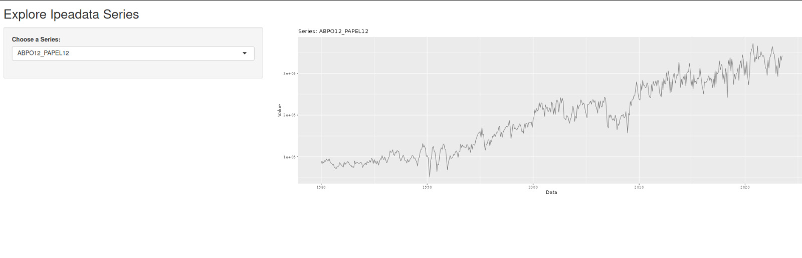

# Exploração Interativa do Ipeadata

Este projeto oferece uma plataforma interativa para explorar várias séries disponíveis no Ipeadata usando R e Shiny. Os usuários podem selecionar diferentes séries e visualizá-las ao longo do tempo.

## Funcionalidades

- Selecione entre várias séries disponíveis no Ipeadata.
- Gráfico interativo para visualizar a série selecionada.
- Construído com R usando Shiny para a interface web e ggplot2 para visualização.

## Exemplo

Um deploy está disponível em [https://chicodias.shinyapps.io/SeriesTemporais/](https://chicodias.shinyapps.io/SeriesTemporais/).
Aqui está um exemplo da tela inicial da aplicação:

Mais funcionalidades serão adicionadas no decorrer deste semestre.

## Como Utilizar

1. Instale os pacotes R necessários: shiny, ipeadatar, ggplot2.
2. Execute o arquivo `app.R` no R ou RStudio para lançar o aplicativo Shiny.
3. Selecione uma série no menu suspenso para visualizá-la.

## Análises 

O nosso grupo conduziu [análises estratégicas](./analises/html/index.html) em conjuntos de dados selecionados devido à sua relevância e impacto potencial. Estas análises foram realizadas usando as linguagens em R e Python e estão disponíveis em formato HTML. Você pode encontrar os documentos completos na pasta `/analises/html` ou acessar cada um diretamente pelos links abaixo:

- [Análise INPC](./analises/html/INPC_(sem_comentário).html)
- [Análise IPCA](./analises/html/IPCA_ST.html)
- [IPC - Exportado](./analises/html/IPC-exported.html)
- [Séries Temporais - Análise Geral](./analises/html/SeriesTemporais.html)
- [Séries Temporais MP 10-10 - Exportado](./analises/html/SeriesTemporais_MP_10-10-exported.html)
- [Séries Temporais - Selic](./analises/html/SeriesTemporais_Selic.html)
- [Taxa de Juros CDI Acumulada no Mês](./analises/html/Taxa_juros_CDI_acumulada_mês-exported.html)

Essas análises fornecem insights aprofundados e visualizações claras das tendências e padrões dos indicadores econômicos em estudo, contribuindo para uma compreensão mais robusta desses fenômenos.

### Contribuições

Encorajamos a comunidade a explorar esses recursos e contribuir com insights. Se você tiver interesse em contribuir com este projeto, seja expandindo nossas análises, corrigindo erros, ou adicionando novas funcionalidades, por favor, sinta-se à vontade para abrir uma issue ou enviar um pull request.

## Licença

Este projeto é de código aberto e está disponível sob a Licença MIT. Veja o arquivo LICENSE para mais detalhes.

## Contato

Para perguntas, sugestões ou colaborações, fique a vontade para incluir uma issue ou pull request.
